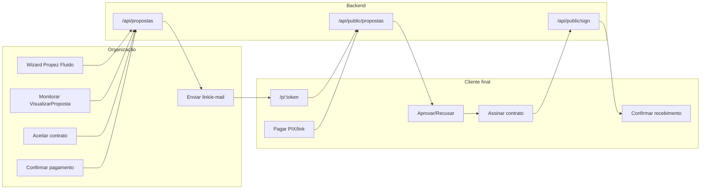
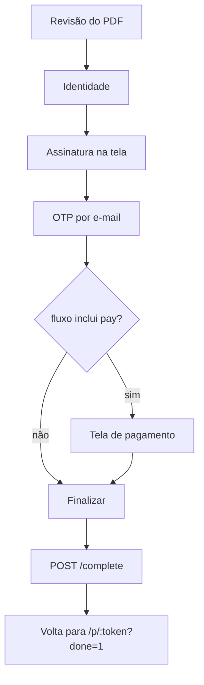
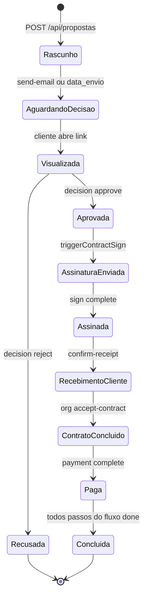

# Fluxo completo: Nova Proposta → Assinatura → Pagamento

Este documento descreve o fluxo ponta a ponta de uma proposta comercial no PropEZ: formulação no wizard, envio ao cliente, aprovação, assinatura nativa de contrato, confirmação bilateral e pagamento.

## Visão geral da arquitetura

O fluxo é dividido em **3 atores** e **5 macro-fases**:

O motor de jornada é o campo **`fluxo`** na proposta (JSONB), com passos configuráveis:

- Padrão: `approve` → `sign` → `pay` ([`src/types/proposalFlow.ts`](../src/types/proposalFlow.ts))
- O passo `approve` é obrigatório; `sign` e `pay` são opcionais por modelo/proposta

**Nota:** o termo "formalização" não existe no código — o equivalente é essa sequência de passos do `fluxo`.

---

## Fase 0 — Pré-requisitos (antes de criar a proposta)

Antes do wizard, a organização precisa ter cadastrado:

| Recurso | Onde | Uso no fluxo |
|---------|------|--------------|
| **Modelos** | [`src/pages/Modelos.tsx`](../src/pages/Modelos.tsx) / [`CriarModelo.tsx`](../src/pages/CriarModelo.tsx) | Template visual (elementos, layout, contrato, PIX, fluxo) |
| **Serviços** | cadastro de serviços | Valores e vínculo com contratos |
| **Contratos** | templates com posições de assinatura | PDF gerado na aprovação |
| **Clientes** | cadastro ou criação inline | Passo 2 do wizard |

Na hidratação do app ([`src/lib/store.ts`](../src/lib/store.ts) → `hydrateStore()`), o wizard carrega em paralelo:

- `GET /api/modelos/summary`
- `GET /api/clientes`
- `GET /api/servicos`
- `GET /api/contratos`
- `GET /api/usage/current` (quota do plano Free)

---

## Fase 1 — Formulação da proposta (Wizard Propez Fluido)

**Rota:** `/app?route=propez-fluido`  
**Orquestrador:** [`src/pages/PropezFluido.tsx`](../src/pages/PropezFluido.tsx)

### Passo 1 — Modelo Base

- Componente: [`Step1ModeloSelect.tsx`](../src/pages/propezFluido/Step1ModeloSelect.tsx)
- Seleciona template de `modelos_propostas`
- `applyModeloToForm()` copia para o formulário: serviços, elementos visuais, layout, texto do contrato, chave PIX, link de pagamento, WhatsApp comprovante e **`fluxo`**
- APIs opcionais: `GET /api/modelos/:id`, `POST /api/ia/resolve-model-images`

### Passo 2 — Cliente

- Componente: [`Step2ClienteForm.tsx`](../src/pages/propezFluido/Step2ClienteForm.tsx)
- Cliente existente **ou** novo (criado no save)
- Integração ProSync: importa lead via modal → preenche nome/e-mail

### Passo 3 — Serviços e valores

- Componente: [`Step3ServicosValores.tsx`](../src/pages/propezFluido/Step3ServicosValores.tsx)
- Toggle de serviços, desconto, recorrência, datas de envio/validade
- Campos de pagamento: `chavePix`, `linkPagamento`, `whatsappComprovante`
- Validações: ≥1 serviço, valor, datas, ≥1 elemento visual

### Passo 4 — Preview

- Componente: [`Step4ModeloPreview.tsx`](../src/pages/propezFluido/Step4ModeloPreview.tsx)
- Preview com variáveis substituídas (`{{cliente_nome}}`, etc.)
- Botão "Confirmar" → `handleSave()`

### Salvamento (`handleSave`)

1. Verifica quota: `canCreateProposal()` ([`featureFlags.ts`](../src/lib/featureFlags.ts))
2. Monta objeto `Proposta` com **`status: 'pendente'`**, **`pago: false`**
3. Se cliente novo → `POST /api/clientes`
4. **`POST /api/propostas`** (ou `PATCH` se edição)
5. Se lead ProSync → gera link público + atualiza CRM
6. Avança para tela de sucesso

**Backend** ([`src/server/routes/propostas.ts`](../src/server/routes/propostas.ts) `POST /`):

- Herda `fluxo` do modelo se não enviado
- Converte valores para centavos
- Incrementa `usage_counters.propostas`
- Emite eventos: `proposal.created`, notificação in-app `proposal_created`

### Passo 5 — Sucesso

- Componente: [`SuccessStep.tsx`](../src/pages/propezFluido/SuccessStep.tsx)
- `POST /api/propostas/:id/public-link` → gera `public_token`, URL `/p/{token}`
- `POST /api/propostas/:id/send-email` → e-mail ao cliente + seta `data_envio`
- Ações: copiar link, WhatsApp, ir para `visualizar-proposta`

**Estado após criação:**

| Campo | Valor |
|-------|-------|
| `status` | `pendente` |
| `pago` | `false` |
| `public_token` | null até gerar link |
| `data_envio` | null (rascunho) ou data do form/e-mail |
| `contract_sign_status` | null |

**Labels na listagem** ([`proposalSubStatus.ts`](../src/lib/proposalSubStatus.ts)):

- Sem `data_envio` → **Rascunho**
- Com `data_envio` → **Aguardando decisão**

---

## Fase 2 — Envio ao cliente

| Ação | Endpoint | Efeito |
|------|----------|--------|
| Gerar link | `POST /api/propostas/:id/public-link` | `public_token` → `/p/{token}` |
| Enviar e-mail | `POST /api/propostas/:id/send-email` | E-mail com link; `data_envio = COALESCE(data_envio, NOW())` |
| Compartilhar manual | — | Copiar link / WhatsApp no SuccessStep |

A organização acompanha em:

- [`src/pages/Propostas.tsx`](../src/pages/Propostas.tsx) — listagem com progresso
- [`src/pages/VisualizarProposta.tsx`](../src/pages/VisualizarProposta.tsx) — detalhe + polling de assinatura (15s)

---

## Fase 3 — Jornada do cliente (link público)

**Página:** [`src/pages/PublicProposta.tsx`](../src/pages/PublicProposta.tsx)  
**Rota:** `/p/:token`  
**API:** [`src/server/routes/publicPropostas.ts`](../src/server/routes/publicPropostas.ts)

### 3.1 Primeira visualização

- `GET /api/public/propostas/:token`
- Seta `viewed_at` na 1ª abertura
- Notificação `proposal_viewed` para a org
- Evento ProSync: `proposal.viewed`

### 3.2 Decisão — Aprovar ou Recusar

- UI: [`ProposalDecisionDock.tsx`](../src/pages/publicProposta/ProposalDecisionDock.tsx)
- `POST /api/public/propostas/:token/decision`
  - Body: `{ action: "approve"|"reject", clientName, clientEmail, clientDocument }`
  - Só aceita se `status === 'pendente'`
  - Aprovação exige CPF/CNPJ

| Ação | `status` | Notificações |
|------|----------|--------------|
| Aprovar | `aprovada` | `proposal_approved` (org + cliente) |
| Recusar | `recusada` | `proposal_rejected` (org + cliente) |

Se recusada → **fim do fluxo** (label "Recusada", progresso 0%).

### 3.3 Disparo automático da assinatura (se `fluxo` inclui `sign`)

Após aprovação, o backend chama `triggerContractSignAfterApproval()` ([`proposalJourney.ts`](../src/server/services/proposalJourney.ts)):

**Pré-condições** (senão pula com `skipped`):

- Contrato configurado (texto ou template PDF)
- `fluxo` contém `sign`
- `cliente_email` preenchido
- Posições de assinatura no template de contrato

**O que acontece** (`contractSigningService.ts` → `sendContractForSigning`):

1. Gera PDF do contrato (texto ou template)
2. Carimba assinatura visual da **empresa**
3. Insere em `contract_documents` (status `WAITING_SIGNATURES`)
4. Cria signatários: org `SIGNED`, cliente `PENDING`
5. Cria `signature_links` com token válido 30 dias
6. Atualiza proposta: `contract_sign_status = 'sent'`, `contract_signing_url`
7. E-mail `contract_sent` (org + cliente, PDF parcial em anexo)
8. Frontend redireciona para `/p/:token/assinar/:signToken`

---

## Fase 4 — Assinatura do contrato (wizard nativo)

**Página:** [`SignContractPage.tsx`](../src/pages/publicProposta/signing/SignContractPage.tsx)  
**Rota:** `/p/:publicToken/assinar/:signToken`  
**API:** [`src/server/routes/signing.ts`](../src/server/routes/signing.ts)

### Etapas do wizard (ordem em `signJourney.ts`)

| Etapa | Endpoint |
|-------|----------|
| Carregar jornada | `GET /api/public/sign/:token` |
| Métodos obrigatórios | `GET /api/public/sign/:token/journey-methods` |
| Identidade | `POST .../auth/identity` |
| Assinatura na tela | `POST .../auth/signature` |
| OTP e-mail | `POST .../auth/otp/request` + `.../verify` |
| Pagamento (se no fluxo) | `POST .../auth/payment/complete` |
| Finalizar | `POST .../complete` |

### Após `complete`

- `contract_sign_status = 'signed'`
- PDF final com assinatura do cliente + relatório de validade
- `contract_documents.status = 'SIGNED'`
- E-mail `contract_signed` (org + cliente com PDF)

### Fases pós-assinatura (`getContractSignPhase`)

| Fase | Condição | UI no cliente |
|------|----------|---------------|
| `not_started` | Sem documento | — |
| `sign_pending` | `sent` ou tem documentId | Redirect para wizard |
| `awaiting_client_receipt` | `signed`, sem `cliente_contrato_recebido_at` | Botão "Confirmar recebimento" |
| `awaiting_org_accept` | Cliente confirmou recebimento | "Aguardando confirmação da org" |
| `complete` | Org aceitou ou `contrato_concluido_at` | "Contrato concluído" + download PDF |

**Confirmação de recebimento pelo cliente:**

- `POST /api/public/propostas/:token/confirm-receipt`
- Seta `cliente_contrato_recebido_at`

**Aceite formal pela organização:**

- UI: [`ContractAcceptancePanel.tsx`](../src/pages/visualizarProposta/ContractAcceptancePanel.tsx)
- `POST /api/propostas/:id/accept-contract`
- Exige: `contract_sign_status === 'signed'` + `cliente_contrato_recebido_at`
- Seta `org_contrato_aceito_at` + `contrato_concluido_at`
- Notificação final `contract_signed`

---

## Fase 5 — Pagamento

**Importante:** pagamento de proposta é **separado** do Stripe SaaS (planos Pro/Business).

### Como funciona hoje

| Aspecto | Implementação |
|---------|---------------|
| Configuração | `chave_pix`, `link_pagamento` (URL externa livre), `whatsapp_comprovante` |
| Stripe nativo para proposta | **Não implementado** — `stripePaymentLink` em featureFlags é só promessa de plano |
| Webhook de pagamento | **Inexistente** — link externo (MP, Stripe Link, etc.) não atualiza `pago` automaticamente |

### Caminhos de confirmação de pagamento

**Caminho A — Na jornada de assinatura** (se `fluxo` inclui `pay` e `sign`):

- Tela: [`SignPayView.tsx`](../src/pages/publicProposta/signing/SignPayView.tsx)
- Exibe PIX, link externo, botão WhatsApp
- Cliente clica "Marcar como pago" → `POST /api/public/sign/:token/auth/payment/complete`
- Backend: `pago = true`, `data_pagamento = NOW()`, notificação `proposal_paid`
- Ocorre **dentro do wizard de assinatura**, antes de `POST /complete`

**Caminho B — Sem passo `sign`, só `pay`:**

- Após aprovação, [`PublicProposta.tsx`](../src/pages/PublicProposta.tsx) exibe PIX/link diretamente
- Confirmação manual pela org (mensagem: "Após o pagamento, {org} confirmará o recebimento")

**Caminho C — Vendedor marca manualmente:**

- Página: [`Pagamentos.tsx`](../src/pages/Pagamentos.tsx) (Financeiro)
- `PATCH /api/propostas/:id` com `{ pago: true, data_pagamento }`
- Notificação `proposal_paid`

**Estado de pagamento:**

- `status` permanece `aprovada` — pagamento é **sub-status**, não muda `status`
- Labels: "Pagamento pendente" / "Pago" ([`proposalSubStatus.ts`](../src/lib/proposalSubStatus.ts))

**Nota sobre progresso:** o passo `sign` só conta como concluído quando `getContractSignPhase` retorna `complete` (org aceitou o contrato). O passo `pay` conta quando `pago === true`. Com fluxo `approve → sign → pay`, é possível o pagamento ser registrado no wizard antes da org aceitar o contrato — nesse caso o progresso pode mostrar pagamento feito enquanto a assinatura ainda aguarda aceite da org.

---

## Mapa completo de estados (happy path padrão `approve → sign → pay`)

### Progresso visual (3 passos padrão)

| Momento | doneSteps | Label primário | Secundários |
|---------|-----------|----------------|-------------|
| Criada, não enviada | 0/3 | Rascunho | — |
| Enviada | 0/3 | Aguardando decisão | Visualizada |
| Aprovada, assinatura pendente | 1/3 | Aprovada | Assinatura pendente |
| Assinada, aguardando cliente | 1/3 | Aprovada | Aguardando cliente |
| Cliente confirmou recebimento | 1/3 | Aprovada | Aguardando seu aceite |
| Org aceitou contrato | 2/3 | Aprovada | Pagamento pendente |
| Pagamento confirmado | 3/3 | **Concluída** | Pago |

---

## Notificações e integrações

| Evento | Gatilho | Destinatários |
|--------|---------|---------------|
| `proposal_created` | `POST /api/propostas` | Org (in-app + e-mail) |
| `proposal_viewed` | 1º GET público | Org |
| `proposal_approved` / `proposal_rejected` | decision | Org + cliente |
| `contract_sent` | PDF gerado | Org + cliente (PDF parcial) |
| `contract_signed` | complete + accept-contract | Org + cliente (PDF final) |
| `proposal_paid` | PATCH pago ou payment/complete | Org |

**ProSync (CRM):** eventos `proposal.viewed`, `proposal.approved`, `proposal.rejected` — **sem** `proposal.paid`. Ver também [`SUITE_PROPEZ_PROPOSAL_EVENTS.md`](./SUITE_PROPEZ_PROPOSAL_EVENTS.md).

**Stripe SaaS** ([`src/server/routes/stripe.ts`](../src/server/routes/stripe.ts)): checkout de planos da plataforma — **não toca** tabela `propostas`.

---

## Arquivos-chave por fase

| Fase | Frontend | Backend |
|------|----------|---------|
| Criação | `PropezFluido.tsx`, `propezFluido/*` | `routes/propostas.ts` |
| Envio | `SuccessStep.tsx` | `propostas.ts` (public-link, send-email) |
| Cliente | `PublicProposta.tsx` | `routes/publicPropostas.ts` |
| Assinatura | `signing/SignContractPage.tsx` | `routes/signing.ts`, `contractSigningService.ts` |
| Jornada | `PublicSignStep.tsx`, `ContractAcceptancePanel.tsx` | `proposalJourney.ts` |
| Pagamento | `SignPayView.tsx`, `Pagamentos.tsx` | `signJourney.ts`, `propostas.ts` PATCH |
| Status UI | `proposalSubStatus.ts` | `proposalFlow.ts` |

---

## Lacunas e observações importantes

1. **Pagamento não é automático** — link externo de pagamento é manual; confirmação depende de humano (vendedor ou cliente "marcar como pago").
2. **Stripe de proposta não existe** — só Stripe para assinatura do plano SaaS da plataforma.
3. **Edição de proposta** — código suporta `editId` no Fluido, mas não há entrada na UI hoje.
4. **Fluxo flexível** — modelo pode ter só `approve`, ou `approve+pay` sem `sign`, alterando quais telas o cliente vê.
5. **Assinatura nativa** — não usa Rubrica externo; campos `rubrica_*` são legado/fallback em queries.

## Documentos relacionados

- [`DIAGNOSTICO_SISTEMA.md`](./DIAGNOSTICO_SISTEMA.md) — visão técnica geral e contratos frontend/backend
- [`integracoes/INTEGRATION_PLAN.md`](./integracoes/INTEGRATION_PLAN.md) — plano de integrações (pagamento manual inicial)
- [`SUITE_PROPEZ_PROPOSAL_EVENTS.md`](./SUITE_PROPEZ_PROPOSAL_EVENTS.md) — eventos ProSync da jornada de proposta
