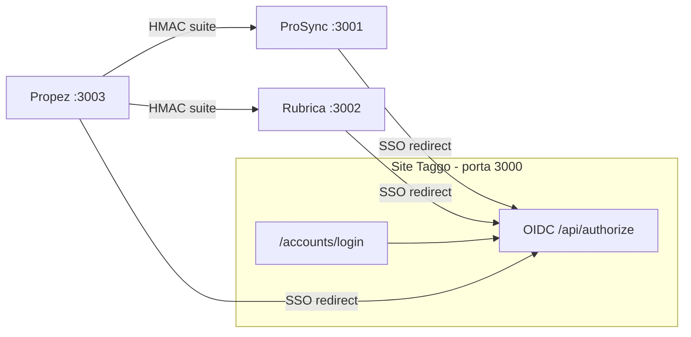

# Guia completo — Suíte Taggo (siga na ordem)

Documento único para configurar e testar **Propez + ProSync + Rubrica + login Taggo (IdP)** do zero.

Use junto com [CHECKLIST.md](./CHECKLIST.md) para marcar o progresso.

---

## Índice

1. [O que você vai montar](#1-o-que-você-vai-montar)
2. [Pré-requisitos](#2-pré-requisitos)
3. [Passo 1 — Gerar e anotar segredos](#passo-1--gerar-e-anotar-segredos)
4. [Passo 2 — SQL nos 4 bancos Neon](#passo-2--sql-nos-4-bancos-neon)
5. [Passo 3 — Configurar variáveis de ambiente](#passo-3--configurar-variáveis-de-ambiente)
6. [Passo 4 — Instalar dependências e subir os 4 serviços](#passo-4--instalar-dependências-e-subir-os-4-serviços)
7. [Passo 5 — Criar usuário no IdP](#passo-5--criar-usuário-no-idp)
8. [Passo 6 — Testar Fase 0 (lookup por email)](#passo-6--testar-fase-0-lookup-por-email)
9. [Passo 7 — Testar Fase 1 (service token)](#passo-7--testar-fase-1-service-token)
10. [Passo 8 — Testar Fase 2 (credenciais por org)](#passo-8--testar-fase-2-credenciais-por-org)
11. [Passo 9 — Testar Fase 3 (SSO)](#passo-9--testar-fase-3-sso)
12. [Passo 10 — Testar Fase 4 (propostas no ProSync)](#passo-10--testar-fase-4-propostas-no-prosync)
13. [Passo 11 — Testar Fase 5 (migração e UI)](#passo-11--testar-fase-5-migração-e-ui)
14. [Produção](#produção)
15. [Problemas comuns](#problemas-comuns)

---

## 1. O que você vai montar



| Fase | O que faz | Resultado para o usuário |
|------|-----------|---------------------------|
| 0 | Lookup por email/senha | Propez sabe se já existe conta no ProSync/Rubrica |
| 1 | Service token | API keys criadas pelo sistema, sem UI manual |
| 2 | Credenciais por org | Cada organização Propez usa sua própria key |
| 3 | SSO OIDC | Um login Taggo abre todos os apps |
| 4 | Eventos de proposta | ProSync mostra propostas Propez no lead |
| 5 | Migração + cleanup | Esconde telas antigas de API key |

---

## 2. Pré-requisitos

- [ ] Node.js 20+ e npm instalados
- [ ] `openssl` no PATH (Git Bash ou OpenSSL no Windows)
- [ ] 4 projetos clonados em `C:\Users\suporte\GitHub\`
- [ ] 4 bancos Postgres (Neon) — um por app
- [ ] Acesso ao SQL Editor de cada Neon

**Schema base já existente:**

- Propez: tabelas `organizations`, `users`, `propostas` (rode `sql/002_core.sql` se for instalação nova)
- ProSync: `users`, `organizations`, `leads`, `api_keys`
- Rubrica: schema Prisma já aplicado (`users`, `api_keys`)
- Site: tabelas do site + SQL da suíte

---

## Passo 1 — Gerar e anotar segredos

Abra **PowerShell** e execute. **Anote** cada valor na tabela abaixo (não commite este papel no git).

```powershell
# 1) Segredo HMAC — UM SÓ para os 4 apps
openssl rand -hex 64

# 2) Cookie do IdP
openssl rand -base64 32

# 3) Secrets OIDC (um por app)
openssl rand -hex 64   # → SECRET_PROPEZ
openssl rand -hex 64   # → SECRET_PROSYNC
openssl rand -hex 64   # → SECRET_RUBRICA

# 4) Chaves RS256 (na pasta onde quiser)
openssl genpkey -algorithm RSA -out private.pem -pkeyopt rsa_keygen_bits:2048
openssl rsa -in private.pem -pubout -out public.pem
```

### Planilha de segredos (preencha)

| Nome | Valor gerado | Onde colar |
|------|--------------|------------|
| `TAGGO_SUITE_SECRET` | | 4 `.env` |
| `TAGGO_ACCOUNTS_COOKIE_SECRET` | | site `.env.local` |
| `SECRET_PROPEZ` | | site `TAGGO_CLIENTS_JSON` + Propez `TAGGO_SSO_CLIENT_SECRET` |
| `SECRET_PROSYNC` | | site `TAGGO_CLIENTS_JSON` + ProSync `TAGGO_SSO_CLIENT_SECRET` |
| `SECRET_RUBRICA` | | site `TAGGO_CLIENTS_JSON` + Rubrica `TAGGO_SSO_CLIENT_SECRET` |
| `TAGGO_JWT_PRIVATE_KEY_PEM` | conteúdo de `private.pem` | site `.env.local` |
| `TAGGO_JWT_PUBLIC_KEY_PEM` | conteúdo de `public.pem` | site `.env.local` |

---

## Passo 2 — SQL nos 4 bancos Neon

Para cada banco, abra o **SQL Editor** do Neon, cole o arquivo indicado e execute **Run**.

| # | Banco Neon | Arquivo para colar |
|---|------------|-------------------|
| 1 | **Site Taggo** | `docs/suite-taggo/sql/SITE-taggo-oidc.sql` |
| 2 | **Propez** | `docs/suite-taggo/sql/PROPEZ-suite.sql` |
| 3 | **ProSync** | `docs/suite-taggo/sql/PROSYNC-suite.sql` |
| 4 | **Rubrica** | `docs/suite-taggo/sql/RUBRICA-suite.sql` |

Caminho completo a partir do Propez:

```
C:\Users\suporte\GitHub\propez_new\docs\suite-taggo\sql\
```

**Como validar:** após rodar, no Neon execute:

```sql
-- Site
SELECT table_name FROM information_schema.tables
 WHERE table_name LIKE 'taggo_%';

-- Propez
SELECT table_name FROM information_schema.tables
 WHERE table_name IN ('org_integration_credentials', 'taggo_identity_links');

-- ProSync
SELECT table_name FROM information_schema.tables
 WHERE table_name IN ('lead_external_proposals', 'taggo_identity_links');
```

---

## Passo 3 — Configurar variáveis de ambiente

Copie os templates de `docs/suite-taggo/templates/` para cada projeto e preencha com a planilha do Passo 1.

| Projeto | Template | Destino |
|---------|----------|---------|
| Site | `templates/site-taggo.env.local.example` | `site-novo-tgs/.env.local` |
| Propez | `templates/propez.env.example` | `propez_new/.env` (mesclar) |
| ProSync | `templates/prosync.env.local.example` | `Prosync/.env.local` |
| Rubrica | `templates/rubrica.env.example` | `Rubrica-Assinaturas/.env` (mesclar) |

### Regras importantes

1. **`TAGGO_SUITE_SECRET`** — mesmo valor nos 4 arquivos.
2. **`TAGGO_CLIENTS_JSON`** (site) — JSON em **uma linha**; `clientSecret` de cada app = `TAGGO_SSO_CLIENT_SECRET` daquele app.
3. **`redirectUris`** — devem bater **exatamente** com `TAGGO_SSO_REDIRECT_URI` de cada app.
4. Em **local**, use `http://localhost:3000` como `TAGGO_ISSUER` / `TAGGO_SSO_ISSUER`.

### Exemplo `TAGGO_CLIENTS_JSON` (local, uma linha)

Substitua os secrets pelos que você gerou:

```json
[{"clientId":"propez","clientSecret":"SEU_HEX_PROPEZ","redirectUris":["http://localhost:3003/api/sso/callback"]},{"clientId":"prosync","clientSecret":"SEU_HEX_PROSYNC","redirectUris":["http://localhost:3001/api/sso/callback"]},{"clientId":"rubrica","clientSecret":"SEU_HEX_RUBRICA","redirectUris":["http://localhost:3002/api/sso/callback"]}]
```

---

## Passo 4 — Instalar dependências e subir os 4 serviços

Abra **4 terminais** (PowerShell). Em cada um:

### Terminal 1 — IdP (obrigatório subir primeiro)

```powershell
cd C:\Users\suporte\GitHub\site-novo-tgs
npm install
npm run dev
```

Deve ficar em **http://localhost:3000**.

### Terminal 2 — ProSync

```powershell
cd C:\Users\suporte\GitHub\Prosync
npm install
npx next dev -p 3001
```

### Terminal 3 — Rubrica

```powershell
cd C:\Users\suporte\GitHub\Rubrica-Assinaturas
npm install
npx next dev -p 3002
```

### Terminal 4 — Propez

```powershell
cd C:\Users\suporte\GitHub\propez_new
npm install
$env:PORT="3003"
npm run dev
```

### Smoke test rápido (com tudo no ar)

```powershell
curl http://localhost:3000/.well-known/openid-configuration
curl http://localhost:3003/api/health
```

---

## Passo 5 — Criar usuário no IdP

No terminal do **site**:

```powershell
cd C:\Users\suporte\GitHub\site-novo-tgs
npm run db:seed-identity
```

Usa `IDENTITY_SEED_EMAIL` / `IDENTITY_SEED_PASSWORD` (ou `ADMIN_EMAIL` / `ADMIN_PASSWORD`) do `.env.local`.

**Teste manual:**

1. Abra http://localhost:3000/accounts/login  
2. Entre com o email/senha do seed  
3. Deve ir para http://localhost:3000/accounts  

---

## Passo 6 — Testar Fase 0 (lookup por email)

### 6.1 Ter um usuário no ProSync ou Rubrica

Crie uma conta normal no ProSync (porta 3001) com email `teste@taggo.com.br` e senha conhecida.

### 6.2 Gerar assinatura HMAC

```powershell
cd C:\Users\suporte\GitHub\propez_new
$env:TAGGO_SUITE_SECRET="COLE_SEU_SECRET"
node scripts/suite-hmac.mjs prosync '{"email":"teste@taggo.com.br","password":"SUA_SENHA"}'
```

Copie `x-taggo-suite-timestamp`, `x-taggo-suite-signature` e o body da saída.

### 6.3 Chamar o endpoint

```powershell
curl -X POST http://localhost:3001/api/identity/lookup `
  -H "Content-Type: application/json" `
  -H "x-taggo-suite-app: propez" `
  -H "x-taggo-suite-timestamp: TIMESTAMP" `
  -H "x-taggo-suite-signature: sha256=..." `
  -d "{\"email\":\"teste@taggo.com.br\",\"password\":\"SUA_SENHA\"}"
```

**Esperado:** HTTP 200, JSON com `"exists": true` e `"passwordMatches": true`.

**Se 401:** `TAGGO_SUITE_SECRET` diferente entre Propez e ProSync.

---

## Passo 7 — Testar Fase 1 (service token)

### 7.1 Pelo Propez (recomendado)

1. Crie/login no Propez (http://localhost:3003) — usuário admin de uma organização.
2. No navegador (DevTools → Network) ou Postman, com cookie de sessão:

```http
POST http://localhost:3003/api/integrations/credentials/prosync/provision
```

**Esperado:** JSON com credencial provisionada / `configured: true`.

### 7.2 Direto no ProSync (HMAC)

```powershell
node scripts/suite-hmac.mjs propez '{"email":"teste@taggo.com.br","action":"create_or_link","partner_app":"propez","scopes":["crm:read","crm:write"]}'
```

```http
POST http://localhost:3001/api/partner/service-token
(+ headers HMAC)
```

**Esperado:** `{ "apiKey": "ps_live_...", "userId": "...", "organizationId": "..." }`

### 7.3 Conferir no banco Propez

```sql
SELECT organization_id, provider, source, key_prefix
  FROM org_integration_credentials;
```

---

## Passo 8 — Testar Fase 2 (credenciais por org)

Com sessão logada no Propez:

```http
GET http://localhost:3003/api/integrations/credentials
GET http://localhost:3003/api/integrations/prosync/leads
```

**Esperado:** lista de leads do ProSync **sem** `PROSYNC_API_KEY` no `.env` do Propez (só suíte).

Script de health:

```powershell
cd C:\Users\suporte\GitHub\propez_new
$env:PROP_EZ_CHECK_URL="http://127.0.0.1:3003"
npm run check:integrations
```

Procure no JSON: `"suite": { "enabled": true, "credentialsEncryption": true }`.

---

## Passo 9 — Testar Fase 3 (SSO)

### 9.1 Discovery

```powershell
curl http://localhost:3000/.well-known/openid-configuration
curl http://localhost:3000/api/jwks
```

### 9.2 Fluxo no navegador (cada app)

| App | URL para abrir |
|-----|----------------|
| Propez | http://localhost:3003/api/sso/start |
| ProSync | http://localhost:3001/api/sso/start |
| Rubrica | http://localhost:3002/api/sso/start |

**Fluxo esperado:**

1. Redireciona para IdP (`/accounts/login` se não logado).
2. Após login, volta ao app com `?code=...`.
3. App abre sessão local.

### 9.3 Status SSO (Propez)

```http
GET http://localhost:3003/api/sso/status
```

**Esperado:** `{ "enabled": true }`

### 9.4 Banco

Após login SSO, verifique `taggo_identity_links` no banco do app correspondente.

---

## Passo 10 — Testar Fase 4 (propostas no ProSync)

### 10.1 Pré-requisitos

- Lead existente no ProSync — copie o **UUID** do lead.
- Propez logado, `TAGGO_SUITE_SECRET` ok.

### 10.2 Criar proposta vinculada ao lead

No Propez, ao criar proposta (API ou UI), envie `prosyncLeadId` = UUID do lead.

```http
POST http://localhost:3003/api/propostas
Body: { ..., "prosyncLeadId": "UUID-DO-LEAD" }
```

Isso dispara `proposal.created` para o ProSync.

### 10.3 Ver no ProSync

1. Abra o lead no CRM.
2. Aba **Propostas Propez**.
3. Deve aparecer a proposta com status e valor.

Ou via API (logado no ProSync):

```http
GET http://localhost:3001/api/partner/proposal-events?leadId=UUID-DO-LEAD
```

### 10.4 Outros eventos (opcional)

| Ação | Evento |
|------|--------|
| Enviar contrato Rubrica | `proposal.sent` |
| Cliente aprova link público | `proposal.approved` |
| Assinatura Rubrica (webhook) | `proposal.signed` |

---

## Passo 11 — Testar Fase 5 (migração e UI)

### 11.1 Migrar keys globais do `.env` (Propez)

Se você ainda usa `PROSYNC_API_KEY` / `RUBRICA_API_KEY` no `.env`:

```powershell
cd C:\Users\suporte\GitHub\propez_new
npm run migrate:suite-credentials -- --dry-run
npm run migrate:suite-credentials
```

### 11.2 UI de integrações oculta

| App | URL | Comportamento default |
|-----|-----|----------------------|
| ProSync | http://localhost:3001/settings/integrations | Aviso suíte nativa |
| ProSync avançado | http://localhost:3001/settings/integrations?advanced=1 | UI antiga |
| Rubrica | http://localhost:3002/settings/integrations | Aviso suíte nativa |
| Rubrica avançado | http://localhost:3002/settings/integrations?advanced=1 | UI antiga |

---

## Produção

### DNS e deploy

1. Deploy **site-novo-tgs** na Vercel → `taggo.com.br`
2. Adicionar domínio **`accounts.taggo.com.br`** no mesmo projeto Vercel
3. Deploy Propez, ProSync, Rubrica nos domínios de produção

### Variáveis de produção

| Variável | Valor produção |
|----------|----------------|
| `TAGGO_ISSUER` / `TAGGO_SSO_ISSUER` | `https://accounts.taggo.com.br` |
| Propez redirect | `https://propez.taggo.com.br/api/sso/callback` |
| ProSync redirect | `https://prosync.tech/api/sso/callback` |
| Rubrica redirect | `https://app.rubrica.com.br/api/sso/callback` |
| `PROSYNC_API_URL` | `https://prosync.tech` |
| `RUBRICA_API_URL` | `https://app.rubrica.com.br` |

Atualize `TAGGO_CLIENTS_JSON` no site com URLs **https** de produção.

### Ordem de go-live sugerida

1. SQL nos 4 Neon de produção  
2. Env + secrets na Vercel de cada app  
3. `db:seed-identity` no site (ou migrar usuários)  
4. Testar `/.well-known/openid-configuration` em produção  
5. SSO em um app (ex. Propez)  
6. Service token + integração  
7. Eventos de proposta  
8. `migrate:suite-credentials` e remover keys globais do `.env`  

---

## Problemas comuns

| Sintoma | Solução |
|---------|---------|
| `Assinatura inválida` | Igualar `TAGGO_SUITE_SECRET` nos 4 apps |
| `Chaves não configuradas` (JWKS) | Preencher PEMs no site |
| SSO `redirect_uri não permitido` | URI exata no `TAGGO_CLIENTS_JSON` |
| SSO `invalid_client` | `clientSecret` igual no JSON e no app |
| Propostas vazias no lead | Proposta precisa de `prosyncLeadId` |
| Health `suite.enabled: false` | Secret com menos de 32 caracteres |
| Webhook Rubrica falha em local | `APP_URL` público (ngrok) ou testar em staging |

---

## Referência rápida de endpoints

### IdP (site :3000)

| Método | Rota |
|--------|------|
| GET | `/.well-known/openid-configuration` |
| GET | `/api/jwks` |
| GET | `/api/authorize` |
| POST | `/api/token` |
| GET | `/api/userinfo` |
| GET | `/accounts/login` |

### ProSync (:3001)

| Método | Rota | Auth |
|--------|------|------|
| POST | `/api/identity/lookup` | HMAC |
| POST | `/api/partner/service-token` | HMAC |
| POST | `/api/partner/proposal-events` | HMAC |
| GET | `/api/partner/proposal-events?leadId=` | Sessão |
| GET | `/api/sso/start` | Público |

### Propez (:3003)

| Método | Rota |
|--------|------|
| GET | `/api/health` |
| GET | `/api/sso/start` |
| GET | `/api/sso/status` |
| GET | `/api/integrations/credentials` |
| POST | `/api/integrations/credentials/:provider/provision` |
| GET | `/api/integrations/prosync/leads` |

---

## Próximo passo

Abra [CHECKLIST.md](./CHECKLIST.md) e marque cada item conforme for concluindo.
