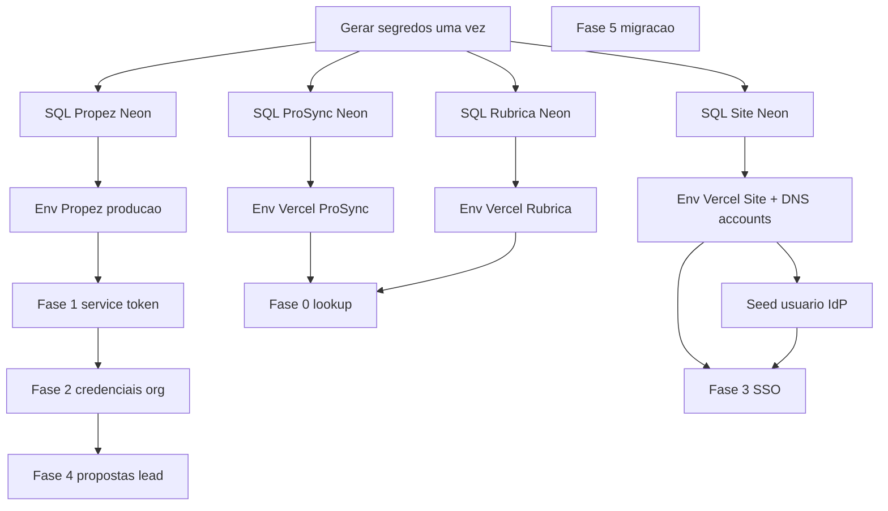

# Teste real em produção — o que fazer em cada projeto

Guia para validar a **Suíte Taggo** em produção. Organizado **por repositório**, na ordem que você deve executar.

**Premissas:**

- ProSync e Rubrica **já estão no ar** (`prosync.tech`, `app.rubrica.com.br`).
- Propez e IdP serão configurados/deployados neste roteiro.
- Um único `TAGGO_SUITE_SECRET` (≥32 caracteres) nos **quatro** ambientes.

Para desenvolvimento local, use [GUIA-COMPLETO.md](./GUIA-COMPLETO.md).

---

## URLs de produção

| App | URL base | Callback SSO |
|-----|----------|--------------|
| **IdP (login Taggo)** | https://accounts.taggo.com.br | — |
| **ProSync** | https://prosync.tech | https://prosync.tech/api/sso/callback |
| **Rubrica** | https://app.rubrica.com.br | https://app.rubrica.com.br/api/sso/callback |
| **Propez** | https://propez.taggo.com.br | https://propez.taggo.com.br/api/sso/callback |

---

## Ordem obrigatória (visão geral)



**Ordem prática recomendada:**

1. Gerar segredos (seção abaixo)
2. SQL nos 4 Neon (pode ser em paralelo)
3. Site Taggo: env + DNS + deploy + seed IdP
4. ProSync: env + redeploy (já no ar)
5. Rubrica: env + redeploy (já no ar)
6. Propez: env + deploy
7. Roteiro de teste integrado (final deste doc)

Marque o progresso em [CHECKLIST.md](./CHECKLIST.md).

---

## Antes de tudo — uma vez só

### Gerar segredos

No PowerShell:

```powershell
openssl rand -hex 64          # TAGGO_SUITE_SECRET (um só, 4 apps)
openssl rand -base64 32       # TAGGO_ACCOUNTS_COOKIE_SECRET (site)
openssl rand -hex 64          # SECRET_PROPEZ
openssl rand -hex 64          # SECRET_PROSYNC
openssl rand -hex 64          # SECRET_RUBRICA
openssl genpkey -algorithm RSA -out private.pem -pkeyopt rsa_keygen_bits:2048
openssl rsa -in private.pem -pubout -out public.pem
```

### Planilha (preencha e guarde em local seguro)

| Variável | Valor | Onde colar |
|----------|-------|------------|
| `TAGGO_SUITE_SECRET` | | Vercel: Site, ProSync, Rubrica, Propez |
| `TAGGO_ACCOUNTS_COOKIE_SECRET` | | Vercel: Site |
| `SECRET_PROPEZ` | | Site `TAGGO_CLIENTS_JSON` + Propez `TAGGO_SSO_CLIENT_SECRET` |
| `SECRET_PROSYNC` | | Site `TAGGO_CLIENTS_JSON` + ProSync `TAGGO_SSO_CLIENT_SECRET` |
| `SECRET_RUBRICA` | | Site `TAGGO_CLIENTS_JSON` + Rubrica `TAGGO_SSO_CLIENT_SECRET` |
| `TAGGO_JWT_PRIVATE_KEY_PEM` | conteúdo `private.pem` | Vercel: Site |
| `TAGGO_JWT_PUBLIC_KEY_PEM` | conteúdo `public.pem` | Vercel: Site |

### `TAGGO_CLIENTS_JSON` (Site — uma linha)

Substitua os secrets pelos valores gerados. Cole no painel Vercel do **site-novo-tgs**:

```json
[{"clientId":"propez","clientSecret":"SEU_SECRET_PROPEZ","redirectUris":["https://propez.taggo.com.br/api/sso/callback"]},{"clientId":"prosync","clientSecret":"SEU_SECRET_PROSYNC","redirectUris":["https://prosync.tech/api/sso/callback"]},{"clientId":"rubrica","clientSecret":"SEU_SECRET_RUBRICA","redirectUris":["https://app.rubrica.com.br/api/sso/callback"]}]
```

Template completo: [templates/site-taggo.env.production.example](./templates/site-taggo.env.production.example)

### SQL (4 bancos Neon)

| Banco | Arquivo |
|-------|---------|
| Site | [sql/SITE-taggo-oidc.sql](./sql/SITE-taggo-oidc.sql) |
| Propez | [sql/PROPEZ-suite.sql](./sql/PROPEZ-suite.sql) |
| ProSync | [sql/PROSYNC-suite.sql](./sql/PROSYNC-suite.sql) |
| Rubrica | [sql/RUBRICA-suite.sql](./sql/RUBRICA-suite.sql) |

---

## 1. Site Taggo (`site-novo-tgs`) — IdP

**Repositório:** `C:\Users\suporte\GitHub\site-novo-tgs`  
**Papel:** Login único OIDC (`accounts.taggo.com.br`)

### Checklist deste projeto

- [ ] SQL rodado no Neon do site
- [ ] Variáveis no Vercel (produção)
- [ ] DNS `accounts.taggo.com.br` → mesmo projeto Vercel do site
- [ ] Deploy concluído
- [ ] Usuário IdP criado (seed)
- [ ] Discovery OIDC responde 200

### Passo a passo

#### 1.1 Banco (Neon)

1. Abra o SQL Editor do Neon do **site**.
2. Cole e execute: `docs/suite-taggo/sql/SITE-taggo-oidc.sql` (caminho a partir do repo Propez, ou copie de `site-novo-tgs/scripts/sql/taggo-oidc.sql`).

#### 1.2 Vercel — Environment Variables

Use [templates/site-taggo.env.production.example](./templates/site-taggo.env.production.example).

Variáveis **obrigatórias** para a suíte:

| Variável | Valor produção |
|----------|----------------|
| `DATABASE_URL` | connection string Neon do site |
| `TAGGO_ISSUER` | `https://accounts.taggo.com.br` |
| `NEXT_PUBLIC_SITE_URL` | `https://taggo.com.br` (ou domínio principal do site) |
| `TAGGO_JWT_PRIVATE_KEY_PEM` | PEM privado RS256 |
| `TAGGO_JWT_PUBLIC_KEY_PEM` | PEM público RS256 |
| `TAGGO_JWT_KID` | `taggo-1` |
| `TAGGO_CLIENTS_JSON` | JSON da seção acima |
| `TAGGO_SUITE_SECRET` | mesmo nos 4 apps |
| `TAGGO_ACCOUNTS_COOKIE_SECRET` | base64 32 chars |
| `NEXTAUTH_SECRET` | secret do NextAuth do site |
| `NEXTAUTH_URL` | `https://taggo.com.br` ou URL principal |

#### 1.3 DNS

No provedor de DNS:

- **Host:** `accounts`
- **Tipo:** CNAME (ou A conforme Vercel)
- **Aponta para:** deploy Vercel do `site-novo-tgs`

No Vercel: adicionar domínio `accounts.taggo.com.br` ao projeto.

#### 1.4 Deploy

Push/deploy normal do `site-novo-tgs`. Aguarde build verde.

#### 1.5 Criar usuário de teste no IdP

Na sua máquina, com `DATABASE_URL` de **produção** no `.env.local` (cuidado: não commitar):

```powershell
cd C:\Users\suporte\GitHub\site-novo-tgs
# Defina IDENTITY_SEED_EMAIL e IDENTITY_SEED_PASSWORD no .env.local
npm run db:seed-identity
```

Ou insira manualmente em `taggo_identity_users` (senha com bcrypt).

#### 1.6 Validar

```powershell
curl https://accounts.taggo.com.br/.well-known/openid-configuration
curl https://accounts.taggo.com.br/api/jwks
```

No navegador:

- https://accounts.taggo.com.br/accounts/login — login com usuário do seed
- https://accounts.taggo.com.br/accounts — sessão ativa após login

**Esperado:** JSON no discovery; JWKS com chave RS256; login funciona.

---

## 2. ProSync (`Prosync`) — já no ar

**Repositório:** `C:\Users\suporte\GitHub\Prosync`  
**URL:** https://prosync.tech

### Checklist deste projeto

- [ ] SQL rodado no Neon ProSync
- [ ] Env `TAGGO_*` no Vercel/hosting
- [ ] Redeploy após alterar env
- [ ] Lookup HMAC OK
- [ ] Service token HMAC OK
- [ ] SSO start OK
- [ ] Aba Propostas Propez no lead (após Propez configurado)

### Passo a passo

#### 2.1 Banco (Neon)

Execute no Neon **ProSync**:

- `docs/suite-taggo/sql/PROSYNC-suite.sql`  
  ou `Prosync/scripts/CREATE_SUITE_INTEGRATION.sql`

#### 2.2 Vercel — adicionar/atualizar env

Template: [templates/prosync.env.production.example](./templates/prosync.env.production.example)

| Variável | Valor |
|----------|-------|
| `TAGGO_SUITE_SECRET` | **igual** ao dos outros 3 apps |
| `TAGGO_SSO_ISSUER` | `https://accounts.taggo.com.br` |
| `TAGGO_SSO_CLIENT_ID` | `prosync` |
| `TAGGO_SSO_CLIENT_SECRET` | `SECRET_PROSYNC` (igual ao JSON do site) |
| `TAGGO_SSO_REDIRECT_URI` | `https://prosync.tech/api/sso/callback` |
| `SUITE_ADVANCED_MODE` | `false` |

Mantenha as demais vars já existentes (`DATABASE_URL`, `AUTH_SECRET`, Stripe, etc.).

#### 2.3 Redeploy

Após salvar env: **Redeploy** no Vercel (ou aguarde deploy automático).

#### 2.4 Validar APIs (HMAC)

No repo Propez:

```powershell
cd C:\Users\suporte\GitHub\propez_new
$env:TAGGO_SUITE_SECRET="SEU_SECRET"
node scripts/suite-hmac.mjs prosync '{"email":"EMAIL_DE_USUARIO_PROSYNC","password":"SENHA"}'
```

Use os headers na saída:

```powershell
curl -X POST https://prosync.tech/api/identity/lookup `
  -H "Content-Type: application/json" `
  -H "x-taggo-suite-app: propez" `
  -H "x-taggo-suite-timestamp: TIMESTAMP" `
  -H "x-taggo-suite-signature: sha256=..." `
  -d "{\"email\":\"EMAIL\",\"password\":\"SENHA\"}"
```

**Esperado:** `200` com `"exists": true`.

Service token (teste):

```powershell
node scripts/suite-hmac.mjs propez '{"email":"EMAIL","action":"create_or_link","partner_app":"propez","scopes":["crm:read","crm:write"]}'
# POST https://prosync.tech/api/partner/service-token com os headers
```

**Esperado:** `apiKey`, `userId`, `organizationId`.

#### 2.5 Validar UI

| Teste | URL | Esperado |
|-------|-----|----------|
| SSO | https://prosync.tech/api/sso/start | Redireciona ao IdP → volta logado no ProSync |
| Integrações | https://prosync.tech/settings/integrations | Aviso “suíte nativa”, não formulário de API key |
| Modo avançado | https://prosync.tech/settings/integrations?advanced=1 | UI legada de API keys |
| Propostas Propez | Lead no CRM → aba **Propostas Propez** | Lista após eventos do Propez (seção 5) |

**Não precisa alterar código** se o deploy já inclui as rotas da suíte — só SQL + env + redeploy.

---

## 3. Rubrica (`Rubrica-Assinaturas`) — já no ar

**Repositório:** `C:\Users\suporte\GitHub\Rubrica-Assinaturas`  
**URL:** https://app.rubrica.com.br

### Checklist deste projeto

- [ ] SQL rodado no Neon Rubrica
- [ ] Env `TAGGO_*` no Vercel/hosting
- [ ] Redeploy
- [ ] Lookup + service token HMAC OK
- [ ] SSO start OK

### Passo a passo

#### 3.1 Banco (Neon)

Execute no Neon **Rubrica**:

- `docs/suite-taggo/sql/RUBRICA-suite.sql`  
  ou `Rubrica-Assinaturas/scripts/create-suite-integration.sql`

#### 3.2 Vercel — env

Template: [templates/rubrica.env.production.example](./templates/rubrica.env.production.example)

| Variável | Valor |
|----------|-------|
| `TAGGO_SUITE_SECRET` | igual aos outros |
| `TAGGO_SSO_ISSUER` | `https://accounts.taggo.com.br` |
| `TAGGO_SSO_CLIENT_ID` | `rubrica` |
| `TAGGO_SSO_CLIENT_SECRET` | `SECRET_RUBRICA` |
| `TAGGO_SSO_REDIRECT_URI` | `https://app.rubrica.com.br/api/sso/callback` |
| `NEXT_PUBLIC_SUITE_ADVANCED_MODE` | `false` |

#### 3.3 Redeploy

Salvar env → redeploy.

#### 3.4 Validar

Mesmo fluxo HMAC do ProSync, trocando URL:

- `POST https://app.rubrica.com.br/api/identity/lookup`
- `POST https://app.rubrica.com.br/api/partner/service-token`
- https://app.rubrica.com.br/api/sso/start
- https://app.rubrica.com.br/settings/integrations → aviso suíte

**Nota:** Rubrica é user-scoped; `organizationId` no lookup vem `null`.

---

## 4. Propez (`propez_new`)

**Repositório:** `C:\Users\suporte\GitHub\propez_new`  
**URL:** https://propez.taggo.com.br

### Checklist deste projeto

- [ ] SQL rodado no Neon Propez
- [ ] Env produção com URLs https
- [ ] Deploy
- [ ] Health com `suite.enabled: true`
- [ ] Provision credenciais ProSync/Rubrica
- [ ] SSO + proposta com lead + eventos

### Passo a passo

#### 4.1 Banco (Neon)

Execute no Neon **Propez**:

- `docs/suite-taggo/sql/PROPEZ-suite.sql`

#### 4.2 Env de produção

Template: [templates/propez.env.production.example](./templates/propez.env.production.example)

| Variável | Valor |
|----------|-------|
| `APP_URL` | `https://propez.taggo.com.br` |
| `DATABASE_URL` | Neon Propez |
| `PROSYNC_API_URL` | `https://prosync.tech` |
| `RUBRICA_API_URL` | `https://app.rubrica.com.br` |
| `TAGGO_SUITE_SECRET` | igual aos outros |
| `CREDENTIALS_KEY` | recomendado (ou deriva do suite secret) |
| `TAGGO_SSO_ISSUER` | `https://accounts.taggo.com.br` |
| `TAGGO_SSO_CLIENT_ID` | `propez` |
| `TAGGO_SSO_CLIENT_SECRET` | `SECRET_PROPEZ` |
| `TAGGO_SSO_REDIRECT_URI` | `https://propez.taggo.com.br/api/sso/callback` |

**Opcional (legado):** `PROSYNC_API_KEY` / `RUBRICA_API_KEY` podem ficar vazias se a suíte estiver ativa.

#### 4.3 Deploy

Deploy do Propez no hosting de produção (mesmo processo que você já usa).

#### 4.4 Migração de credenciais (se tinha keys globais)

Se antes usava `PROSYNC_API_KEY` / `RUBRICA_API_KEY` no `.env` de produção:

```powershell
cd C:\Users\suporte\GitHub\propez_new
$env:DATABASE_URL="postgresql://...producao..."
$env:TAGGO_SUITE_SECRET="..."
$env:CREDENTIALS_KEY="..."
npm run migrate:suite-credentials -- --dry-run
npm run migrate:suite-credentials
```

#### 4.5 Validar

```powershell
curl https://propez.taggo.com.br/api/health
curl https://propez.taggo.com.br/api/sso/status
```

**Esperado no health:** `"suite": { "enabled": true, "credentialsEncryption": true }`

Logado no Propez (browser ou API com cookie):

```http
POST https://propez.taggo.com.br/api/integrations/credentials/prosync/provision
POST https://propez.taggo.com.br/api/integrations/credentials/rubrica/provision
GET  https://propez.taggo.com.br/api/integrations/credentials
GET  https://propez.taggo.com.br/api/integrations/prosync/leads
```

SSO no navegador: https://propez.taggo.com.br/api/sso/start

---

## 5. Roteiro de teste integrado (ponta a ponta)

Execute **nesta ordem** após os 4 projetos configurados.

| # | Ação | Onde | Resultado esperado |
|---|------|------|-------------------|
| 1 | Discovery OIDC | `curl accounts.taggo.com.br/.well-known/...` | JSON com `issuer`, endpoints |
| 2 | Login IdP | https://accounts.taggo.com.br/accounts/login | Sessão IdP ativa |
| 3 | SSO Propez | https://propez.taggo.com.br/api/sso/start | Logado no Propez sem digitar senha de novo |
| 4 | SSO ProSync | https://prosync.tech/api/sso/start | Logado no ProSync |
| 5 | SSO Rubrica | https://app.rubrica.com.br/api/sso/start | Logado no Rubrica |
| 6 | Provision ProSync | Propez logado → POST `.../credentials/prosync/provision` | `configured: true` |
| 7 | Provision Rubrica | POST `.../credentials/rubrica/provision` | `configured: true` |
| 8 | Listar leads | GET `.../integrations/prosync/leads` | Lista de leads da org |
| 9 | Criar proposta | Propez com `prosyncLeadId` = UUID do lead | Proposta criada |
| 10 | Ver no ProSync | Lead → aba **Propostas Propez** | Proposta com status/valor |
| 11 | Enviar Rubrica | Propez → integração Rubrica na proposta | `proposal.sent`; lead atualizado |
| 12 | Assinatura | Cliente assina; webhook Rubrica → Propez | `proposal.signed` no ProSync; status signed |

### Dados que você precisa anotar antes do teste 9–12

- Email de usuário com conta no **ProSync** e no **Propez** (idealmente mesmo email após SSO).
- **UUID do lead** no ProSync (copiar da URL ou API).
- **UUID da proposta** no Propez (após criar).

### Conferir no banco (opcional)

**Propez — credenciais:**

```sql
SELECT organization_id, provider, source, key_prefix
  FROM org_integration_credentials;
```

**ProSync — propostas externas:**

```sql
SELECT lead_id, external_id, status, title, external_url
  FROM lead_external_proposals
 ORDER BY updated_at DESC
 LIMIT 10;
```

---

## 6. Troubleshooting (produção)

| Sintoma | Causa provável | O que fazer |
|---------|----------------|-------------|
| `Assinatura inválida` em lookup/service-token | `TAGGO_SUITE_SECRET` diferente entre apps | Igualar nos 4 Vercel; redeploy |
| `Chaves não configuradas` no JWKS | PEMs vazios no site | Preencher `TAGGO_JWT_*_PEM`; redeploy site |
| SSO `redirect_uri não permitido` | URI não está em `TAGGO_CLIENTS_JSON` | Copiar URI **exata** do `TAGGO_SSO_REDIRECT_URI` |
| SSO `invalid_client` | Secret do app ≠ secret no JSON | Conferir `SECRET_PROPEZ` etc. |
| Health `suite.enabled: false` | Secret &lt; 32 chars ou ausente | `openssl rand -hex 64` |
| Aba Propostas Propez vazia | Proposta sem `prosync_lead_id` | Criar/vincular lead ao criar proposta |
| Webhook Rubrica não atualiza ProSync | `APP_URL` do Propez inacessível | Confirmar `https://propez.taggo.com.br` público |
| Provision falha 502 | ProSync/Rubrica rejeitam HMAC ou URL errada | Testar lookup manual com `suite-hmac.mjs` |

---

## Referência rápida — arquivos úteis

| Recurso | Caminho |
|---------|---------|
| SQL Site | [sql/SITE-taggo-oidc.sql](./sql/SITE-taggo-oidc.sql) |
| SQL ProSync | [sql/PROSYNC-suite.sql](./sql/PROSYNC-suite.sql) |
| SQL Rubrica | [sql/RUBRICA-suite.sql](./sql/RUBRICA-suite.sql) |
| SQL Propez | [sql/PROPEZ-suite.sql](./sql/PROPEZ-suite.sql) |
| HMAC helper | `propez_new/scripts/suite-hmac.mjs` |
| Checklist | [CHECKLIST.md](./CHECKLIST.md) |
| Guia local | [GUIA-COMPLETO.md](./GUIA-COMPLETO.md) |

---

**Última atualização:** documento para teste real em produção com ProSync e Rubrica já no ar.
